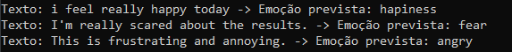

# Rede neural para classificação de emoções
## Autor: Luan Fellipe (allen08)

## Descrição:
### Construção de um modelo de rede neural em python para classificar textos curtos em diferentes emoções.

## [*] Bibliotecas para execução
- pip install tensorflow scikit-learn numpy pandas matplotlib

## [*] Baixar dataset
- https://drive.google.com/file/d/1SDfus-3qytj3-OMQk_ELGw2B9cxIbgnh/view?usp=drive_link

### [*] Respostas da análise de exemplo:

